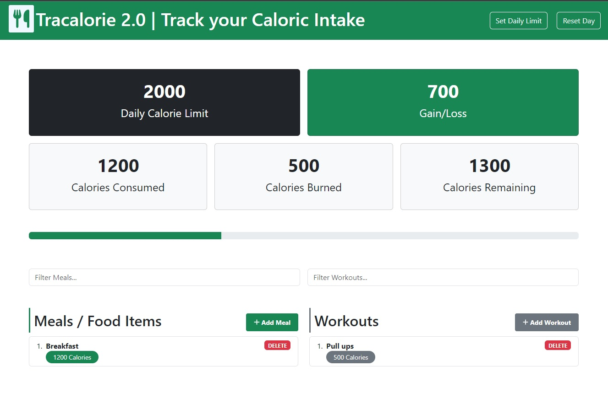

<div align="center">
  
  <h1>Anderson Toledo Martins Moreira</h1>
  <h4>
    Frontend Software Developer » Salesforce Administrator & Developer <br />
    <a href="http://www.atmm.dev" target="_blank">Resume Online</a> -
    <a href="https://www.linkedin.com/in/atmmoreira" target="_blank">Linkedin</a> -
    <a href="https://trailblazer.me/id/atmmdev" target="_blank">Trailblazer</a>
  </h4>
</div>

<!-- References for Create budgets :: https://shields.io/category/build -->
<div align="center">
     
</div>

## Description
Example of CRUD using localstorage with vanilla javascript, html5, css3 and bootstrap.

## Old Layout

<div align="center">
  
</div>

## New Layout and Project Diagram

<div align="center">
  
</div>

<br>

### Project Diagram

<div align="center">
  
</div>

<br>

## Programming Languages and Frameworks.
```Bash
# Bootstrap 5.2
# HTML5 / CSS3 / SASS
# Javascript
# OOP
```

## System Requirements
```Bash
# Git
# Node
```

## Getting Started With Local Development Configuration

```bash
# Download or clone the repository.
# Open the project inside your favorite IDE (I use VSCode).
# If you have the extension `Live Server` installed.
# Click on the file index.html with right button in yor mouse, and select `Open with Live server`
# If NOT, you just open the file index.html in your favorite browser.

--------
# To see the new layout and code, please change for branch 'feature/new-layout'.

```